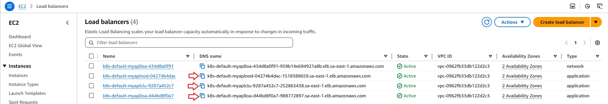

# Sensedia  HelloWorld Application
 
To use this repository, the infra structure should already be provisioned on AWS. 
The following repository holds the Terraform Config Files to deploy the required infra structure to be used to delivery the application. 

https://github.com/deciobarrosjr/sensedia-infra

 

## About the Hello World application
The Hello World application is located on the folder APL-HelloWorld inside this repository. 
It´s a very simple Python application that basically uses the Flask Microframework to render a web page response as illustrated bellow:  

	

 

The application will render the following information: 

> **Hostname:** the hostname of the node where the application is running on. The hostname is recovered by the application from the Operating System.
 

> **Service Type:** the Service Type is the value that is passed to the application using the values.yaml during the application deployment to the cluster. In this challenge it´s LoadBalancer.

 

## Requirements to deploy the application
The application deployment is done using a bash script called force-apply-all.

### Required repositories
This challenge uses two GitHub repositories as described bellow: 

> **sensedia-infra**: This GitHub repository will hold the infra structure provisioning config files. 
> **sensedia-apl**: This GitHub repository will hold the application, help and delivery terraform config files. 

### Required environment variables

 
PAT_DECIO_GITHUB: to hold your PAT(Personal Access Token) with all the required access to run the pipeline. If you have your own PAT available on GitHub, you may just change the actual PAT_DECIO_GITHUB with your secret on the .github/workflows. 
AWS_ACCESS_KEY_ID: This is your AWS access key ID. This access key ID, along with a corresponding secret access key, is used to authenticate and authorize requests made to AWS services via the AWS Command Line Interface (CLI).If you have your own AWS_ACCESS_KEY_ID available on GitHub, you may just change the actual AWS_ACCESS_KEY_ID with your secret on the .github/workflows. 
AWS_SECRET_ACCESS_KEY: This is your AWS secret access key. If you have your own AWS_SECRET_ACCESS_KEY available on GitHub, you may just change the actual AWS_SECRET_ACCESS_KEY with your secret on the .github/workflows. 
TF_TOKEN_APP_TERRAFORM_IO: This secret is used to authenticate Terraform Cloud or Terraform Enterprise when running Terraform commands. It stores the personal access token that grants access to your Terraform Cloud or Terraform Enterprise account.

### Required variables

PREFIX_NAME: This is a prefix used on the deployments to compose the many resources being created by this workflow. 
AWS_REGION: The region used to create the resources. The same region as the one used to create the infra structure. 
ACCOUNT_ID: This is the AWS AccountID where the resources will be deployed. 

 

## Making changes on the application

To test a change applied to the application the best way to go is changing the file /APL-HelloWorld/templates/index.html. 
You may, for example, change the color that will be used to render the page as illustrated bellow: 

    

 

## Provisioning the application
I created a GitHub workflow to provision the application named CI Build for Sensedia Challenge. The image bellow illustrated the workflow is configured for execution: 

    

 

The workflow will be triggered everytime a push is done on the specified branches above. 
It can also be manuaaly executed as illustrated by the image bellow:

 

## Running the application locally on Visual Code

The following procedure should be use to execute the Python app inside the VC: 

Opem a terminal window on VC and change to the following folder: APL-HelloWorld" 
Executes the following command: python3 app.py

 

## Accessing the application from the internet

	

 

## Destroying the resources created

I created a manual GitHub workflow all the resources provisioned named Manual Destroy Workflow. The image bellow illustrated how to execute this workflow: 

    

 

## Existing limitation

* **aws-actions/configure-aws-credentials@v3**: based on the best practices, this action was supposed to be using the OIDC provider. Will keep this way for simplicity but i will create a specific repo/POC to explain how to use the correct authentication mode.
